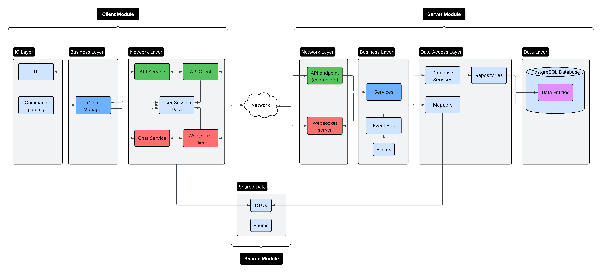

# README

### Overview

---

T-Chat is a lightweight Java messaging app built with Spring Boot to bring secure, real-time communication to the command line. It features:

- **Real-time messaging** - instant message delivery using Spring WebSocket and STOMP protocols for bidirectional communication
- **Secure Communication** - JWT-based authentication for secure user sessions
- **Presence System** - real-time online/offline status tracking of your contacts
- **File Sharing** - Built-in file upload and download capabilities
- **Terminal UI** - clean terminal interface built with Lanterna library

### System Requirements

---

**Server:**

- **Operating system** - Windows 10/11, MacOs 10.14+, Linux
- **RAM** - Minimum ~512MB
- **Storage** - Testing ~512Mb, more for small deployment
- **Network** - open port 8080
- **Software**: JDK 24, Apache Maven 3.11.0+, PostgreSQL (optional)

**Client**

- **Operating system** - Windows 10/11, MacOs 10.14+, Linux
- **Java Runtime** - Java 24
- **RAM** - 256Mb
- **Storage** - 50MB
- **Software**: JDK 24, Apache Maven 3.11.0+

### Quick Start

---

**Server:**

First start the server

```bash
# Clone github repo
git clone https://github.com/maringallien/Tchat

# Navigate to directory
cd Tchat

# Build the project
mvn clean compile

# Run the server module
mvn -pl server -am spring-boot:run
```

**Client**

Then run the client

```bash
# Run the client module
mvn -pl client -am spring-boot:run

# Register
register <username> <email> <password>

# Login
login <email> <password>

# Discover available commands
help
```

### Architecture Overview

---

The application follows a multi-module Maven structure:

- **Server Module** - Spring boot backend handling authentication, WebSocket connections, REST API requests, message routing, and data persistence.
- **Client Module** - Lightweight client application with WebSocket and API connectivity, in charge of IO
- **Shared Module** - DTOs and enums shared between the client and server modules


### Code Documentation

---

This project uses Dokka documentation. To generate documentation:

For **all modules**:

```bash
mvn dokka:dokka
```

For a **specific module**:

```bash
# Replace <module> with either server, client, or shared
mvn dokka:dokka -pl <module>
```

To **read** documentation, in the desired module, head to: `target/dokka/index.html` This will open the documentation in your web browser.

### Test Documentation

---

Please find test documentation here: TEXTING

### Project Information

---

- **Date** - 11/08/2025
- **Version** - 1.0
- **Author** - Marin Gallien
- **Copyright** - @ 2025 Marin Gallien
- **License**: MIT License